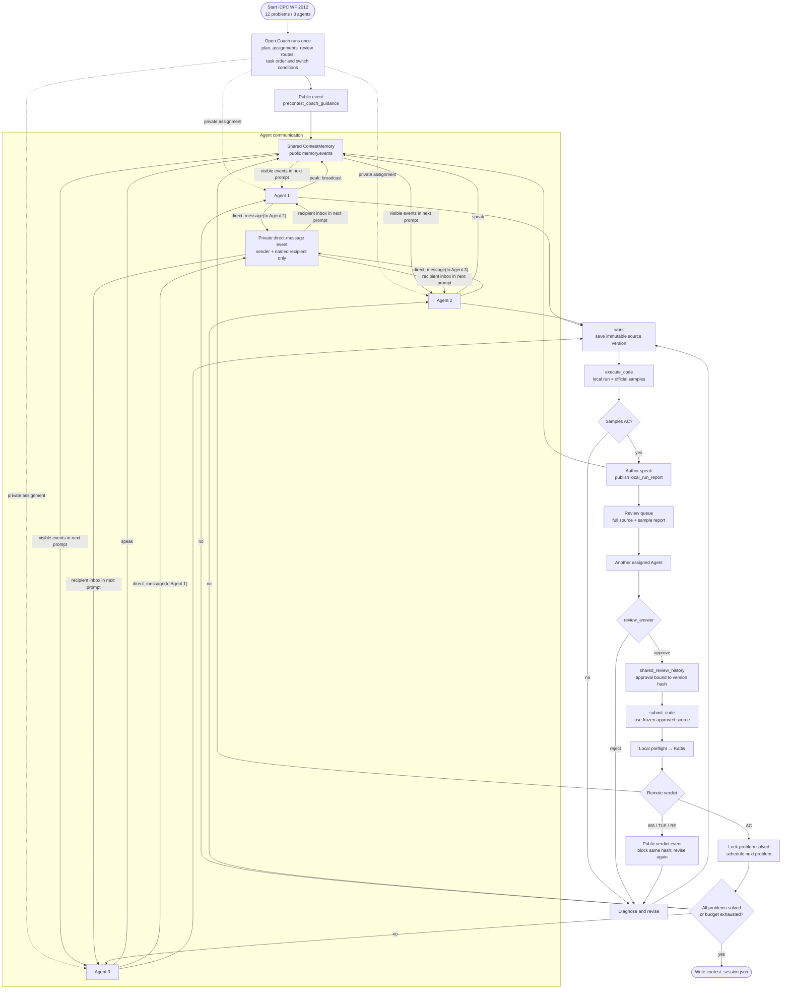

# Open Table Coach — batch results (2026-08-29 – 2026-09-01)

> Author: Zhongzheng (compiled from live runs)  
> Scope: `agent-team-features-main` — `open_table_coach` schema  
> Last updated: 2026-09-03

## Summary

Structured-gold task batch (32 problems) and programming pilots (Codeforces / ICPC) all use **`open_table_coach`** with `rules_mode=enforced`. Task runs also enable task + collaboration LLM judges (MultiAgentBench CS, 0–5).

> **Repo note:** artifacts live under `agent-team-features-main/results/`. Run batches from that repo root.

---

## 1. Structured-gold batch (32 tasks)

**Competitions:** `arml_local` (6), `arml_national_team` (11), `purple_comet` (14), `hmmt_guts` (1).

```bash
cd agent-team-features-main
e:\agent_olympiad\.venv\Scripts\python.exe src/run_competition_batch.py --live \
  --structured-gold \
  --competitions arml_local,arml_national_team,purple_comet,hmmt_guts \
  --schema open_table_coach --rules-mode enforced \
  --judge-task --judge-collab \
  --output results/<run_dir>
```

Resume: `--resume` on the same `--output` directory.

### 1.1 Model comparison

| Model | Provider | Status | Tasks | Macro | Score | CS (0–5) | Artifact |
|---|---|---|---:|---:|---:|---:|---|
| `openai/gpt-5.4-mini` | Perplexity | **done** | 32/32 | **35.5%** | **491 / 1196** | **3.53** | `results/task_based_structured_gold_perplexity_20260829/` |
| `Qwen/Qwen3.5-35B-A3B-Base` | Tinker | **running** | 10/32 | 68.8%* | 318 / 460* | 2.55* | `results/task_based_structured_gold_tinker_qwen35_35b_base_20260831/` |

\*Partial through `arml_national_team_2012`; numbers will change until 32/32.

Monitor Qwen run: `results/task_based_structured_gold_tinker_qwen35_35b_base_20260831/run.log` (PID in `batch.pid`).

### 1.2 Per-competition totals

**GPT-5.4-mini (complete)**

| Competition | Tasks | Score |
|---|---:|---:|
| `arml_local` | 6 | 167 / 260 |
| `arml_national_team` | 11 | 271 / 550 |
| `purple_comet` | 14 | 51 / 350 |
| `hmmt_guts` | 1 | 2 / 36 |

**Qwen3.5-Base (partial, 2026-09-01)**

| Competition | Tasks done | Score |
|---|---:|---:|
| `arml_local` | 6/6 | 153 / 260 |
| `arml_national_team` | 4/11 | 165 / 200 |
| `purple_comet` | 0/14 | — |
| `hmmt_guts` | 0/1 | — |

### 1.3 Per-task scores — GPT-5.4-mini

| Problem | Score | Turns | CS |
|---|---:|---:|---:|
| arml_local_2009 | 22.2/40 | 16/30 | 4.0 |
| arml_local_2010 | 26.7/40 | 22/30 | 3.5 |
| arml_local_2011 | 35.0/40 | 10/30 | 4.0 |
| arml_local_2012 | 26.7/40 | 11/30 | 4.0 |
| arml_local_2013 | 6.7/40 | 16/30 | 3.5 |
| arml_local_2014 | 50.0/60 | 17/30 | 4.0 |
| arml_national_team_2009 | 50.0/50 | 11/30 | 4.5 |
| arml_national_team_2010 | 10.0/50 | 11/30 | 3.5 |
| arml_national_team_2011 | 35.0/50 | 11/30 | 3.5 |
| arml_national_team_2012 | 40.0/50 | 10/30 | 4.0 |
| arml_national_team_2013 | 35.0/50 | 10/30 | 3.0 |
| arml_national_team_2014 | 30.0/50 | 10/30 | 4.0 |
| arml_national_team_2016 | 0.0/50 | 10/30 | 2.5 |
| arml_national_team_2017 | 10.0/50 | 10/30 | 3.5 |
| arml_national_team_2018 | 11.1/50 | 11/30 | 4.0 |
| arml_national_team_2019 | 5.0/50 | 11/30 | 3.5 |
| arml_national_team_2023 | 45.0/50 | 23/30 | 3.5 |
| hmmt_guts_2024 | 2.0/36 | 11/30 | 3.5 |
| purple_comet_hs_2018 | 4.0/30 | 20/30 | 3.5 |
| purple_comet_ms_2018 | 1.0/20 | 19/30 | 3.5 |
| purple_comet_hs_2019 | 3.0/30 | 18/30 | 3.5 |
| purple_comet_ms_2019 | 3.0/20 | 21/30 | 2.5 |
| purple_comet_hs_2020 | 5.0/30 | 19/30 | 4.0 |
| purple_comet_ms_2020 | 4.0/20 | 15/30 | 3.0 |
| purple_comet_hs_2021 | 4.0/30 | 20/30 | 3.0 |
| purple_comet_ms_2021 | 5.0/20 | 24/30 | 3.0 |
| purple_comet_hs_2022 | 3.0/30 | 18/30 | 3.0 |
| purple_comet_ms_2022 | 5.0/20 | 16/30 | 3.5 |
| purple_comet_hs_2023 | 2.0/30 | 20/30 | 3.5 |
| purple_comet_ms_2023 | 3.0/20 | 17/30 | 4.0 |
| purple_comet_hs_2024 | 4.0/30 | 19/30 | 4.0 |
| purple_comet_ms_2024 | 5.0/20 | 21/30 | 3.0 |

### 1.4 Per-task scores — Qwen3.5-Base (partial)

| Problem | Score | Turns | CS |
|---|---:|---:|---:|
| arml_local_2009 | 22.2/40 | 27/30 | 2.5 |
| arml_local_2010 | 20.0/40 | 14/30 | 2.0 |
| arml_local_2011 | 30.0/40 | 13/30 | 2.0 |
| arml_local_2012 | 31.1/40 | 30/30 | 3.0 |
| arml_local_2013 | 20.0/40 | 16/30 | 3.0 |
| arml_local_2014 | 30.0/60 | 11/30 | 2.5 |
| arml_national_team_2009 | 50.0/50 | 11/30 | 3.5 |
| arml_national_team_2010 | 35.0/50 | 12/30 | 2.0 |
| arml_national_team_2011 | 45.0/50 | 22/30 | 3.0 |
| arml_national_team_2012 | 35.0/50 | 10/30 | 2.0 |

**Early read:** Qwen leads on ARML part accuracy so far but uses more turns/API and scores lower on CS than GPT-5.4-mini. Purple Comet / HMMT pending for Qwen.

Transcripts: `results/<run_dir>/*/transcripts/*__open_table_coach__enforced.json`

---

## 2. Programming + VJudge (`open_table_coach` or other schemas)

Local **sample judge** + optional **VJudge remote** (`VJUDGE_GATEWAY_URL`, problem mode `CodeForces-4A` / `Kattis-{id}`). Remote needs valid cookie + CF account binding; low-rated CF accounts may hit Turnstile (`Challenge Encountered`). See also `docs/VJUDGE_INTEGRATION_FEASIBILITY.md`.

### 2.1 Codeforces

| Run | Problem | Schema | Local sample | Remote (VJudge) | Notes |
|---|---|---|---|---|---|
| `results/vjudge_cf_4a_three_schemas/single_agent/` | `cf_4A` | single_agent | **AC** | `login_required` | 8/8 turns |
| `results/vjudge_cf_4a_three_schemas/centralized/` | `cf_4A` | centralized | **AC** | `login_required` | 8/8 turns |
| `results/vjudge_cf_4a_three_schemas/decentralized/` | `cf_4A` | decentralized | **AC** + CE | `login_required` | 14 wrong subs |
| `results/vjudge_cf_231a_open_table_coach/` | `cf_231A` | **open_table_coach** | **AC** | `duplicate_code` / **Challenge** | submit turn 7/12 |

Model for CF runs: `Qwen/Qwen3.6-35B-A3B` (Tinker).

### 2.2 ICPC Kattis

| Run | Model | Schema | Problem(s) | Result |
|---|---|---|---|---|
| `results/icpc_bottles_open_table_coach/` | Qwen3.6-35B-A3B | **open_table_coach** | `icpc_wf_2012_bottles` | 12/12 turns, no submit, protocol violations |
| `results/icpc_kattis_10_perplexity_20260831/` | GPT-5.4-mini | **open_table_coach** | 10× WF2012 Kattis | **2/10 remote AC** (`bottles`, `fibonacci`) |

ICPC remote AC used VJudge problem mode (`Kattis-bottles`, etc.). See `docs/from_zhongzheng/icpc-evaluation-and-leaderboard.md` for pipeline details.

---

## 3. Current Open Coach flow: ICPC World Finals 2012

This is the current `strategic_team` programming workflow with the pre-contest
Open Coach, using the 12-problem ICPC World Finals 2012 contest as an example.
The Coach runs once, persists the team plan and private assignments, and exits.
The three contestant Agents then solve, test, review, submit, and recover.



Agents now have two chat channels:

- Direct chat: `direct_message(recipient, content)` → private event in
  `memory.events` → injected only into the sender and named recipient prompts;
- Team broadcast: `speak(content)` → public event in `memory.events` →
  injected into every agent's later prompts.

Code, sample results, and reviews also share the same state:

- Raw `execute_code` run details are private to the executor by default;
- Other agents see a report only after the author publishes a `local_run_report`
  via `speak`;
- Frozen source and review decisions are stored in `shared_review_history`;
- Public events such as `review_answer` and Kattis verdicts enter `memory.events`;
- In the result file `contest_session.json`, communication lives under top-level
  `memory.events`, and versioned reviews live under top-level
  `shared_review_history`.

Key constraints:

- There is one shared active-problem cursor; Coach assignments determine which
  problem each Agent may work on or review.
- Local sample AC, public `speak`, and independent `review_answer` must all refer
  to the same immutable source version before `submit_code` is available.
- Any source revision creates a new version hash and invalidates the old review.
- Sample failures are local and free. Remote non-AC verdicts add ranking penalty,
  but no longer consume simulated contest time.
- Agent communication lives in `memory.events`; source versions and decisions
  are also materialized in `shared_review_history`.

---

## 4. Related docs

| Doc | Contents |
|---|---|
| `worklog-8.21.md` | Open Table Coach design, rule-card injection, single-problem ARML pilot |
| `icpc-evaluation-and-leaderboard.md` | ICPC judge axes, package layout, leaderboard utility |
| `../VJUDGE_INTEGRATION_FEASIBILITY.md` | Gateway, cookie, problem vs contest submit mode |
